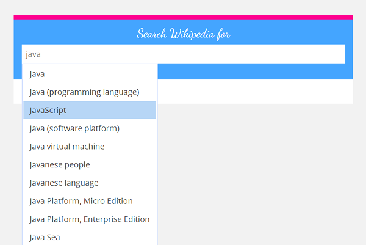

Vaadin autocomplete addon
=========================

This addon introduces a component named `AutocompleteField` primarily intended
to display a set of choices retrieved from a slow source (can be the database
or some search API working over the network). Main points:

 - Not `Container` based: you set a query listener that dinamically fetches
   choices, and you are called back when the user selects one
 - Users can still type their own query and you can read it via `getText()`
 - Queries are not sent to the server side immediately, but only after the user
   has stopped typing (the timeout is configurable). You can also configure the minimum
   query characters count (default is 3), and the query is trimmed by default



Both the API and the implementation are in the early development stages and must
be considered experimental. Suggestions are welcomed. At the moment, here is how
the API looks like:

```java
AutocompleteField<WikipediaPage> search = new AutocompleteField<>();

search.setQueryListener(new AutocompleteQueryListener<WikipediaPage>() {
  @Override
  public void handleUserQuery(AutocompleteField<WikipediaPage> field, String query) {
    field.clearChoices();
    for (WikipediaPage page : queryWikipediaApi(query)) {
      field.addSuggestion(page, page.getTitle());
    }
  }
});

search.setSuggestionPickedListener(new AutocompleteSuggestionPickedListener<WikipediaPage>() {
  @Override
  public void onSuggestionPicked(WikipediaPage page) {
    handleSuggestionSelection(page);
  }
});
```
   
At the moment I didn't find a good way to integrate with the `Property` API, mainly
because the component can be used for two distinct purposes:

 1. Entering text, possibly assisted by server suggestions
 2. Selecting an item

Maybe the best way would be exposing two server side components.

The code is organized in two directories (Maven projects):

 - `autocomplete` contains the code for the Autocomplete addon
 - `demo` is the test application to exercise the Autocomplete API

As long as the addon is not released on Maven central, it must be installed locally
to satisfy the dependency of the demo application:

    # In autocomplete
    mvn clean install

Then one can start the demo with the following commands in the `demo`
directory and then visit [http://localhost:8080/app](http://localhost:8080/app) :

    # Compiles the widgetset. Only needed the first time
    mvn clean
    mvn package
    mvn jetty:run

To develop you may also want to run the GWT code server:

    mvn vaadin:run-codeserver


Developers here
===============

After making changes to the addon, you may want to

    # In the "autocomplete" project
    mvn clean install

And to see the result in the provided UI:

    # In the "demo" project
    # If widgetset needs to be recompiled
    mvn clean package 
    mvn jetty:run

There are currently two UIs:

  - `DemoUI`, which is intended to be put online as the live demo of this component.
    It's deployed at [http://localhost:8080/app](http://localhost:8080/app)
  - `DevUI`, which is for testing deployed at [http://localhost:8080](http://localhost:8080)

